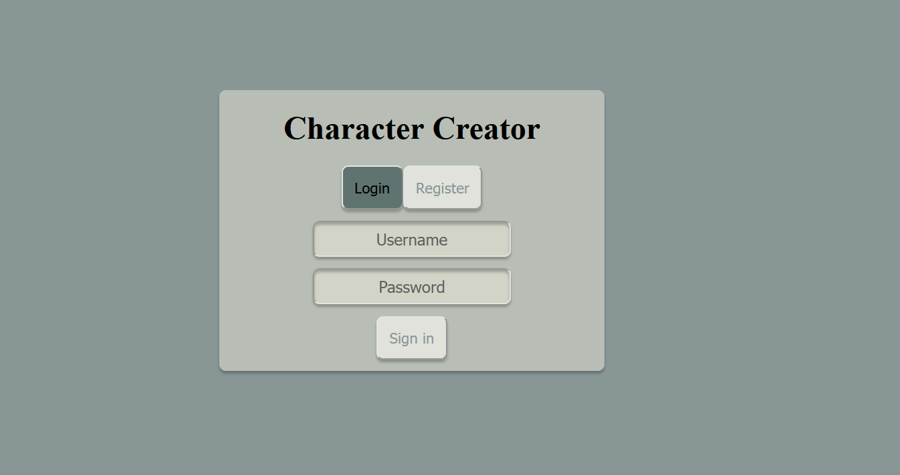
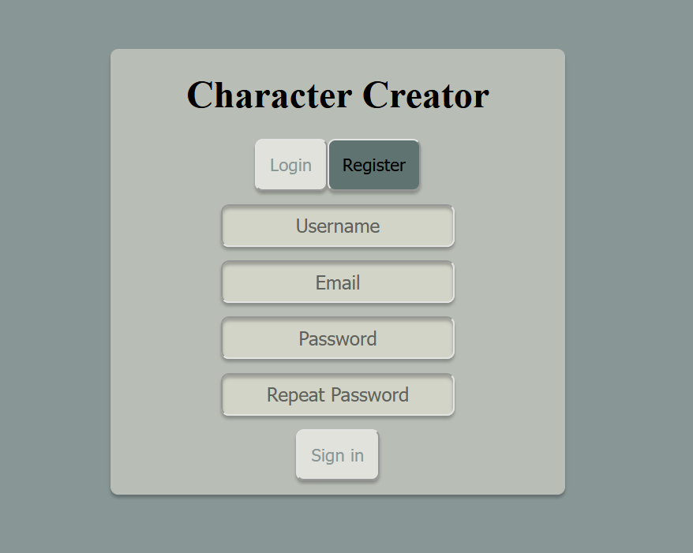
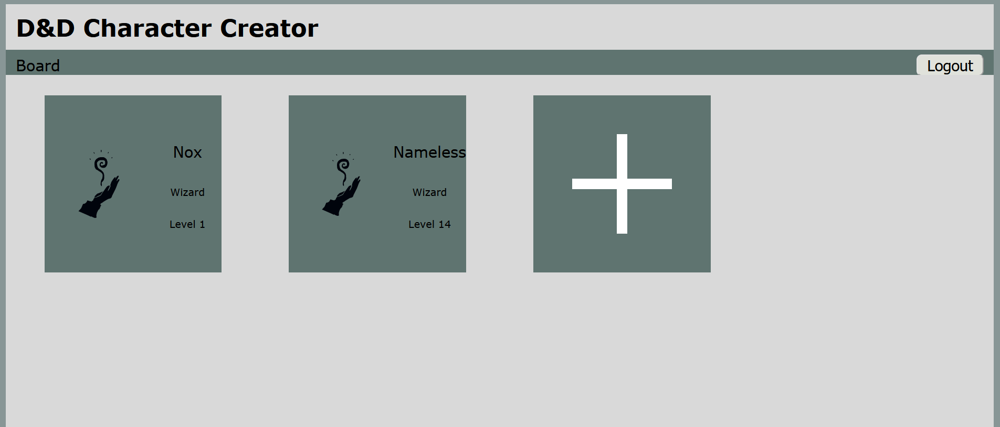
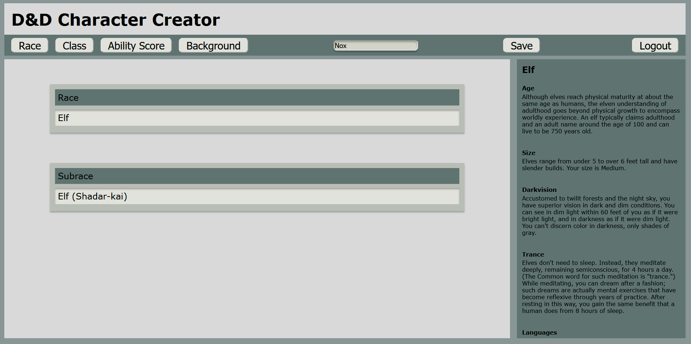
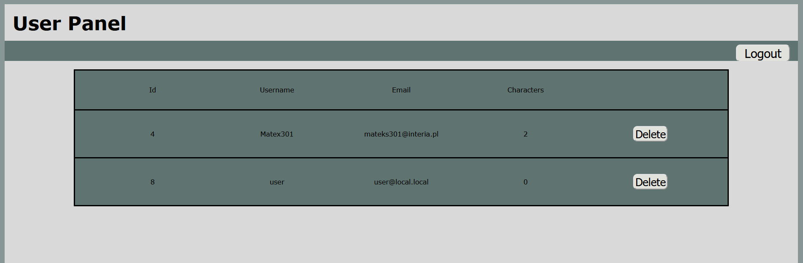
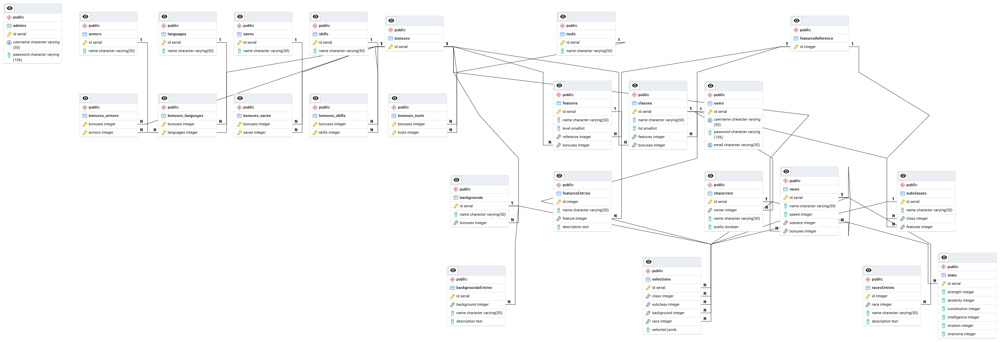

# DnD Character Creator

## Table of contents
- [About](#about)
- [Tech Stack](#tech-stack)
- [Requirements](#requirements)
- [Installation](#installation)
- [Accounts](#test-accounts)
- [Screenshots](#screenshots)
- [ER Diagram](#er-diagram)

## About
Application to create and store Dungeons & Dragons characters.
After registration the user can create many character sheets.
The application automatically shows all available options.
Admin has ability to remove users accounts from app.

## Tech Stack
- Docker
- PostgreSQL
- PHP
- HTML
- CSS
- JavaScript

## Requirements
- [Docker](https://www.docker.com/)

## Installation
- Run `docker compose up` command in main project folder
- Import data from `wdpai.sql` to database
  - pgAdmin at `localhost:5050`
- Application at `localhost:80`

## Test accounts
- User account `username: user` `password: password`
- Admin account `username: admin` `password: password`
  - Admin panel at `localhost:80/admin`

## Screenshots
### Login panel

### Registration panel

### Board

### Race panel in Builder

### Admin panel

## ER Diagram
